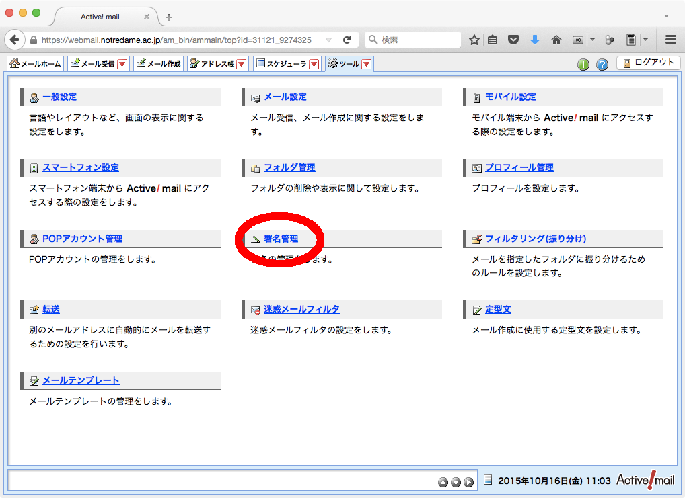
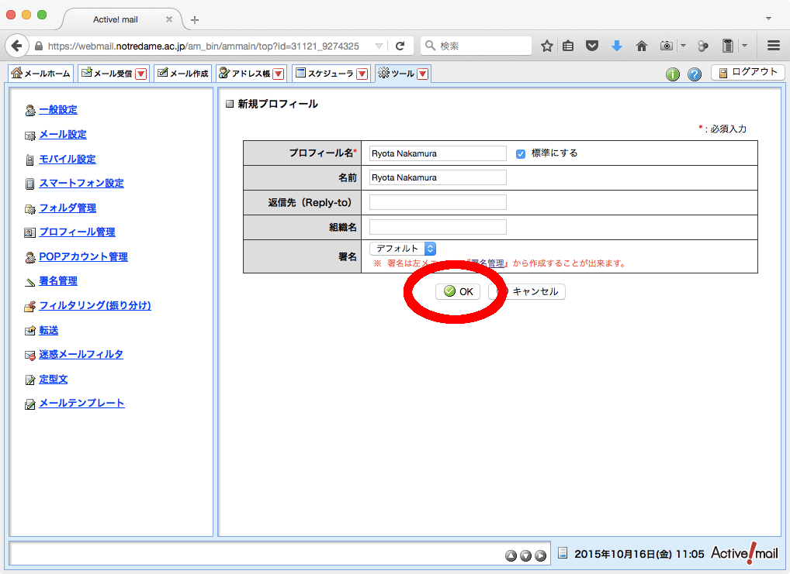

# Active! mailの設定

メールの末尾に「署名」を入れておくこともメールマナーの一つです。
しかし毎回、署名を入力するのは面倒ですので自動で挿入されるように設定しよう。

## ログイン直後の画面


## Active! mailの設定画面を開く


## Active! mailの設定画面


## 署名の設定画面を開く


## 署名の設定画面


## 署名の新規作成


## 署名の作成

Hint: 署名の記述例

```
---
京都　花子（学籍番号：〇〇〇〇）
京都ノートルダム女子大学　△△学部□□学科
メールアドレス：xxxxxx@notredame.ac.jp
```


## 作成した署名を保存


## 署名保存後の画面


## プロフィールの設定画面を開く


## プロフィールの設定画面


## プロフィールの新規作成


## プロフィールの作成


## プロフィールの保存


## プロフィール保存後の画面
