# webページの学内公開方法

## サーバへデータをアップロードするソフト「WinSCP」の起動
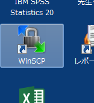

## WinSCPを起動した時の画面
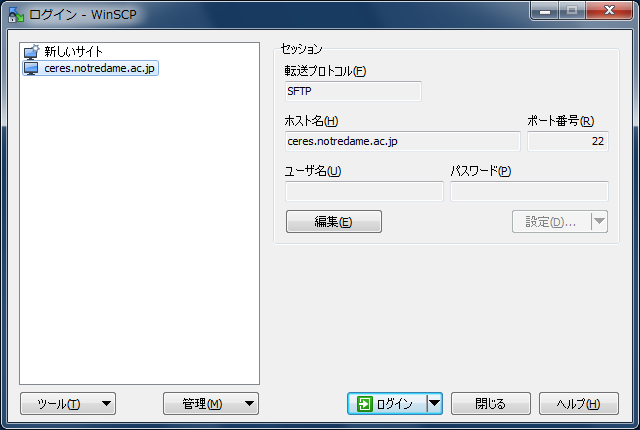

## サーバにログイン
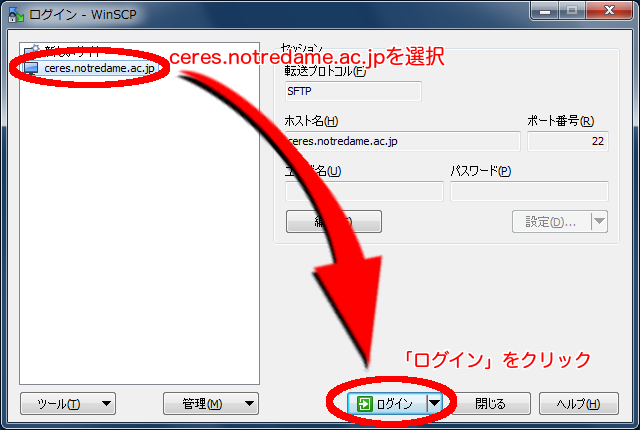

## ログインを押した直後のウィンドウ
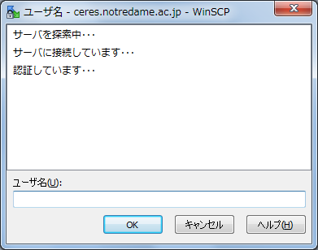

## ユーザ名の入力
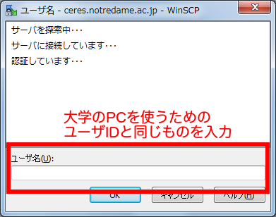

## ユーザ名を入力し「OK」をクリック
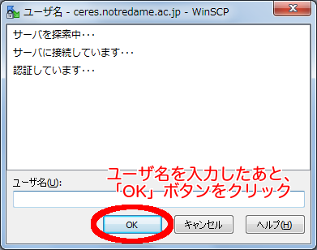

## サーバアクセスの認証に関する情報
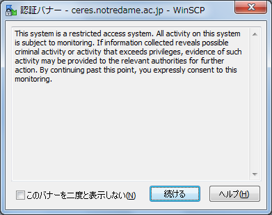

## 認証情報を読んで「続ける」ボタンをクリック
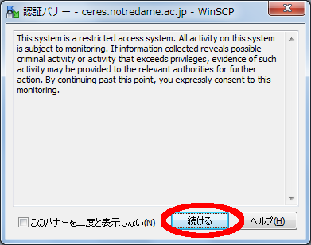

## 「続ける」を押した直後のウィンドウ
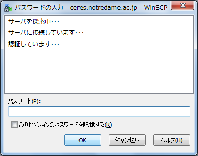

## パスワードを入力
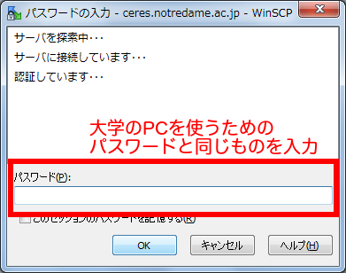

## パスワードを入力し「OK」をクリック
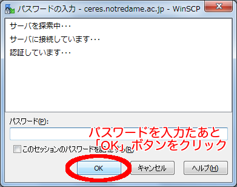

## パスワードの入力で「OK」を押してログインが成功したときの画面
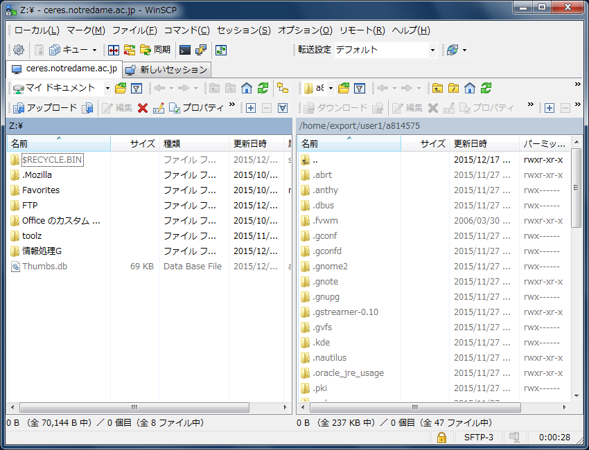

## 左側がローカル、右側がサーバ
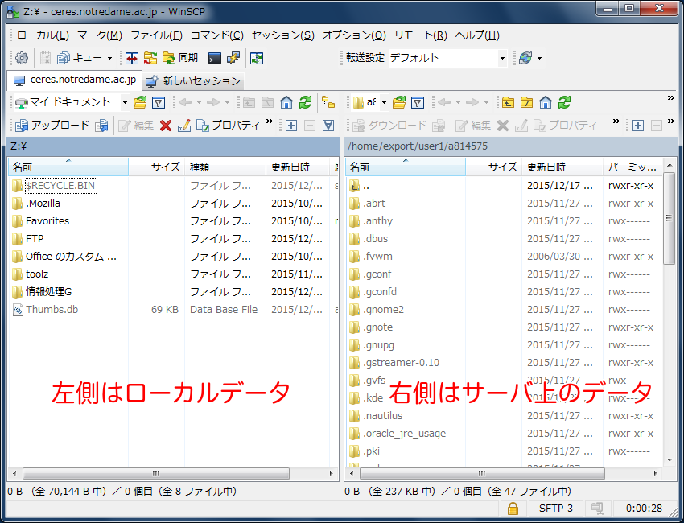

## Web公開用のディレクトリへ移動
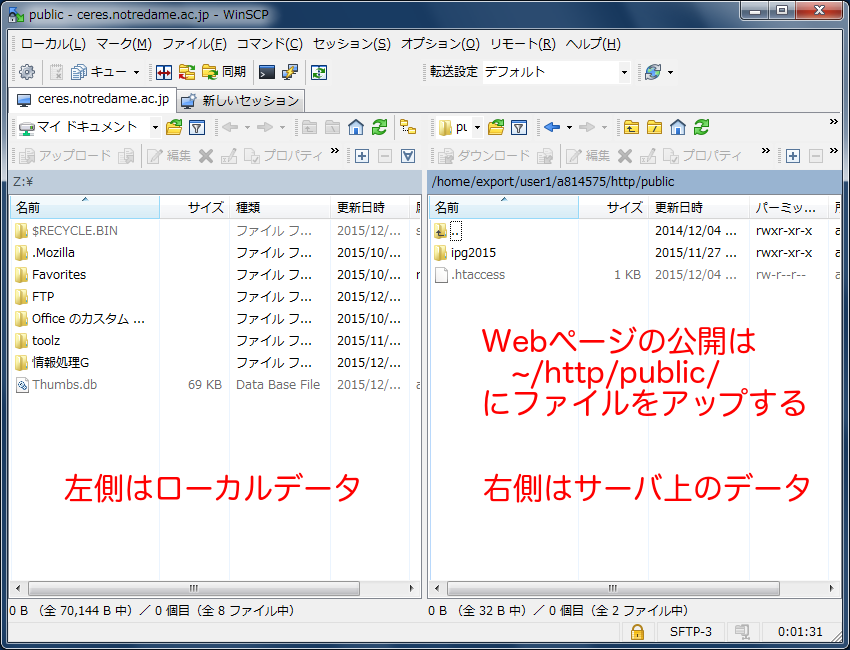

## ファイルのアップロード方法
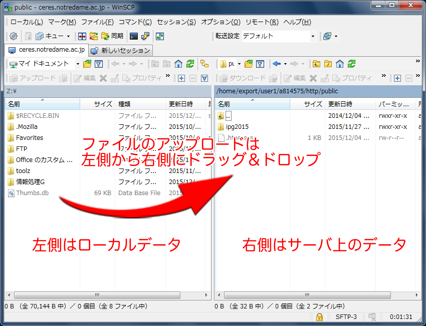