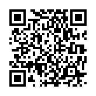

# KNDU授業資料置き場

Ryota Nakamuraが[京都ノートルダム女子大学](http://www.notredame.ac.jp/)で担当している授業の資料です。

## 問い合わせ先

* a814575 あーと notredame.ac.jp
  * あーとを@にしてください

## 2016年度

* 情報科学概論A
* [情報処理G](lecture/2016infoG.md)

## 2015年度

* 情報科学概論A
* 情報処理G

## スマートフォンでアクセス

https://xdncl.github.io/kndu/

## 更新履歴

* コミットログを参照してください
  * [GitHubコミットログ](https://github.com/xDNCL/kndu/commits/gh-pages)