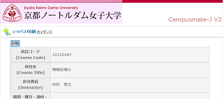
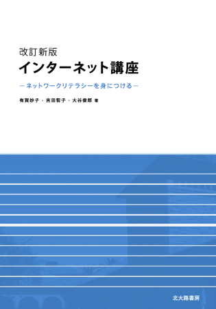

# 2016年度 情報処理G

## シラバス

画像をクリックすると全文を画像で閲覧できます。

### 科目の教育目標

インターネット上で使えるさまざまなサービス（機能）は、新しいコミュニケーション手段であり、情報伝達のためのメディアである。その中心は電子メールとWebページと言える。それらの操作を覚えるのはむずかしくないが、それを活用できる能力（ネットワークリテラシー）を身につけるには、教育が必要である。
この科目では、各機能の特性、多様性や可能性を理解するために、講義に加えて実習も行う。Webページの制作では、HTMLタグを直接記述する方法でのページを記述し、情報発信力を習得する。
さらに、コンピュータの本質を理解するために、PEN(Programming Environment for Novices)と呼ばれる初学者向けプログラミング環境を用いた、実習も行う。

## テキスト

[改訂新版 インターネット講座 -ネットワークリテラシーを身につける-](http://www.tomo.gr.jp/internet/)

## 授業

| 回数 | 授業日 | タイトル |
|:-:|:--|:--|
|第01回目|2016/09/30(金)|[ガイダンス＆コンピュータの基礎知識](2016infoG/01.md)|
|第02回目|2016/10/07(金)|[インターネット上の機能（電子メールなど）の理解と利用](2016infoG/02.md)|
|第03回目|2016/10/14(金)|[プログラミング入門1](2016infoG/03.md)|
|第04回目|2016/10/21(金)|[プログラミング入門2](2016infoG/04.md)|
|第05回目|2016/11/04(金)|[プログラミング入門3](2016infoG/05.md)|
|第06回目|2016/11/11(金)|[プログラミング入門4](2016infoG/06.md)|
|第07回目|2016/11/18(金)|[プログラミング入門5](2016infoG/07.md)|
|第08回目|2016/11/25(金)|[OSとディレクトリ階層構造の理解](2016infoG/08.md)|
|第09回目|2016/12/02(金)|[情報検索と批判的閲覧](2016infoG/09.md)|
|第10回目|2016/12/09(金)|[HTMLで記述するWWWの情報提供のしくみと可能性](2016infoG/10.md)|
|第11回目|2016/12/16(金)|[MDwikiを使ったwebページ制作実習1](2016infoG/11.md)|
|第12回目|2017/01/06(金)|[MDwikiを使ったwebページ制作実習2](2016infoG/12.md)|
|第13回目|2017/01/13(金)|MDwikiを使ったwebページ制作実習3|
|第14回目|2017/01/20(金)|webページの学内公開|
|第15回目|2017/01/27(金)|まとめテスト|

## 宿題一覧表

- [宿題一覧表](2016infoG/kadaiList.md)

## まとめテスト

Attention! 持ち込み可能 ＆ プログラミングの問題のみPC使用可能

### プログラミング入門過去問題

- [プログラミング入門過去問題](2016infoG/pro-kako.pdf)
- [プログラミング入門過去問題（模範解答）](2016infoG/pro-kako_ans.pdf)