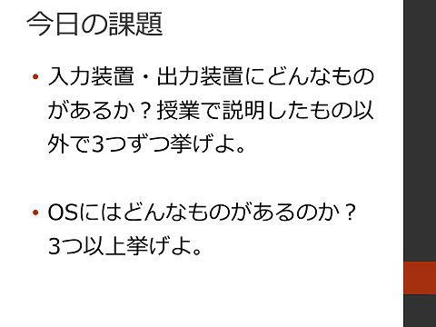

#  2016年度 情報処理G 第01回目

[←2016年度 情報処理Gのページに戻る](#!lecture/2016infoG.md)

## ガイダンス＆コンピュータの基礎知識

### 配布資料

- [レジュメ](01/01resume.pdf)

### ガイダンス

1. 担当者について
2. 情報処理Gについて
3. 何を学ぶか
4. 講義の予定
5. 成績のつけ方

### 情報演習室について

- 図書館情報センター ユーザズガイド2016
- [パスワードを変更したいときは？](https://nais.notredame.ac.jp/its/guide/chpass.html)
- [USBメモリを使うときは？](https://nais.notredame.ac.jp/its/guide/usb.html)
- [データのバックアップについて](https://nais.notredame.ac.jp/its/guide/backup.html)
- [大学のメールを使うには？](https://nais.notredame.ac.jp/its/guide/howtomail.html)
	- メールについては次回の授業で詳しく説明します

### コンピュータの基礎知識

1. コンピュータの五大装置 ([Wikipedia](https://ja.wikipedia.org/wiki/%E3%82%B3%E3%83%B3%E3%83%94%E3%83%A5%E3%83%BC%E3%82%BF%E3%81%AE5%E5%A4%A7%E8%A3%85%E7%BD%AE)), ([e-Words](http://e-words.jp/w/%E3%82%B3%E3%83%B3%E3%83%94%E3%83%A5%E3%83%BC%E3%82%BF%E3%81%AE%E4%BA%94%E5%A4%A7%E8%A3%85%E7%BD%AE.html))
	1. 制御装置 ([Wikipedia](https://ja.wikipedia.org/wiki/%E5%88%B6%E5%BE%A1%E8%A3%85%E7%BD%AE)), ([e-Words](http://e-words.jp/w/%E5%88%B6%E5%BE%A1%E8%A3%85%E7%BD%AE.html))
	2. 演算装置 ([Wikipedia](https://ja.wikipedia.org/wiki/%E6%BC%94%E7%AE%97%E8%A3%85%E7%BD%AE)), ([e-Words](http://e-words.jp/w/ALU.html))
	3. 記憶装置 ([Wikipedia](https://ja.wikipedia.org/wiki/%E8%A8%98%E6%86%B6%E8%A3%85%E7%BD%AE)), ([e-Words](http://e-words.jp/w/%E8%A8%98%E6%86%B6%E8%A3%85%E7%BD%AE.html))
		1. 主記憶装置 ([Wikipedia](https://ja.wikipedia.org/wiki/%E4%B8%BB%E8%A8%98%E6%86%B6%E8%A3%85%E7%BD%AE)), ([e-Words](http://e-words.jp/w/%E3%83%A1%E3%82%A4%E3%83%B3%E3%83%A1%E3%83%A2%E3%83%AA.html))
		2. 補助記憶装置 ([Wikipedia](https://ja.wikipedia.org/wiki/%E8%A3%9C%E5%8A%A9%E8%A8%98%E6%86%B6%E8%A3%85%E7%BD%AE)), ([e-Words](http://e-words.jp/w/%E3%82%B9%E3%83%88%E3%83%AC%E3%83%BC%E3%82%B8.html))
	4. 入力装置 ([Wikipedia](https://ja.wikipedia.org/wiki/%E5%85%A5%E5%87%BA%E5%8A%9B)), ([e-Words](http://e-words.jp/w/%E5%85%A5%E5%8A%9B%E8%A3%85%E7%BD%AE.html))
	5. 出力装置 ([Wikipedia](https://ja.wikipedia.org/wiki/%E5%85%A5%E5%87%BA%E5%8A%9B)), ([e-Words](http://e-words.jp/w/%E5%87%BA%E5%8A%9B%E8%A3%85%E7%BD%AE.html))
2. オペレーティングシステム ([Wikipedia](https://ja.wikipedia.org/wiki/%E3%82%AA%E3%83%9A%E3%83%AC%E3%83%BC%E3%83%86%E3%82%A3%E3%83%B3%E3%82%B0%E3%82%B7%E3%82%B9%E3%83%86%E3%83%A0)), ([e-Words](http://e-words.jp/w/OS.html))

## 本日の課題

[←2016年度 情報処理Gのページに戻る](#!lecture/2016infoG.md)