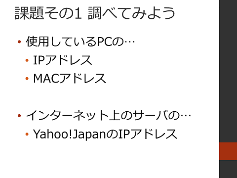
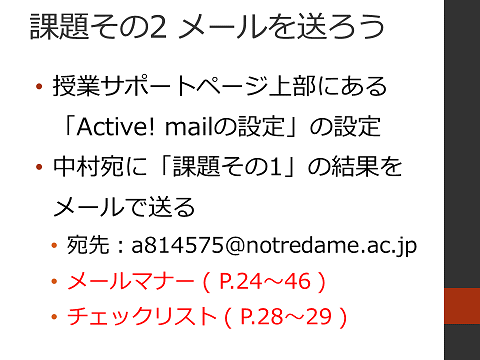
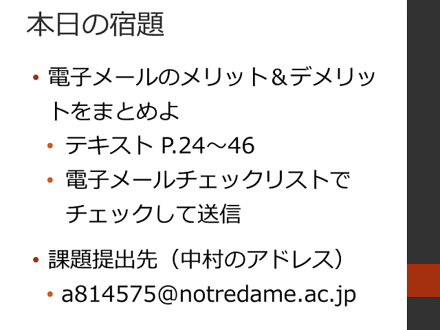

#  2016年度 情報処理G 第02回目

[←2016年度 情報処理Gのページに戻る](#!lecture/2016infoG.md)

## インターネット上の機能（電子メールなど）の理解と利用

### 配布資料

- [レジュメ](02/02resume.pdf)
- [電子メールチェックリスト](http://www.tomo.gr.jp/internet/pdf/sheet_2_1.pdf)

### フィードバック＆前回の復習

1. 記憶装置の容量について
	- [EPSON：ハードディスク容量が少なく表示される](http://faq.epsondirect.co.jp/faq/edc/app/servlet/relatedqa?QID=011043)
	- [BUFFALO：ハードディスク容量の計算方法](http://faq.buffalo.jp/app/answers/detail/a_id/1087)
2. 主記憶装置の価格例
	- [メモリ 8GB*2](https://www.amazon.co.jp/dp/B009URHXMW)
3. 補助記憶装置の価格例
	- [HDD 3TB](https://www.amazon.co.jp/dp/B015FGGWKU)
	- [SSD 250GB](https://www.amazon.co.jp/dp/B00S1V3FZC)
4. 前回の復習
	1. コンピュータの五大装置
		- 入力装置
		- 出力装置
	2. オペレーティングシステム

### インターネット上の機能の理解と利用

1. インターネットの仕組み 【テキスト P.178-190】
	- OSI参照モデル ([＠IT](http://www.atmarkit.co.jp/ait/articles/0007/19/news001.html)), ([Wikipedia](https://ja.wikipedia.org/wiki/OSI%E5%8F%82%E7%85%A7%E3%83%A2%E3%83%87%E3%83%AB))
	- TCP/IPプロトコルの概要 【テキスト P.185-186】 ([＠IT](http://www.atmarkit.co.jp/ait/articles/0008/10/news002.html)), ([Wikipedia](https://ja.wikipedia.org/wiki/TCP/IP%E3%83%A2%E3%83%87%E3%83%AB))
	- 通信プロトコル ([＠IT](http://www.atmarkit.co.jp/ait/articles/0005/22/news007.html)), ([Wikipedia](https://ja.wikipedia.org/wiki/%E9%80%9A%E4%BF%A1%E3%83%97%E3%83%AD%E3%83%88%E3%82%B3%E3%83%AB))
2. インターネット上のアドレス
	- MACアドレス ([Wikipedia](https://ja.wikipedia.org/wiki/MAC%E3%82%A2%E3%83%89%E3%83%AC%E3%82%B9)), ([e-Words](http://e-words.jp/w/MAC%E3%82%A2%E3%83%89%E3%83%AC%E3%82%B9.html))
	- IPアドレス 【テキスト P.180】 ([Wikipedia](https://ja.wikipedia.org/wiki/IP%E3%82%A2%E3%83%89%E3%83%AC%E3%82%B9)), ([e-Words](http://e-words.jp/w/IP%E3%82%A2%E3%83%89%E3%83%AC%E3%82%B9.html))
	- ドメイン名 【テキスト P.181-185】 ([Wikipedia](https://ja.wikipedia.org/wiki/%E3%83%89%E3%83%A1%E3%82%A4%E3%83%B3%E5%90%8D)), ([e-Words](http://e-words.jp/w/%E3%83%89%E3%83%A1%E3%82%A4%E3%83%B3.html))
		- DNS 【テキスト P.187-188】 ([Wikipedia](https://ja.wikipedia.org/wiki/DNS)), ([e-Words](http://e-words.jp/w/DNS.html))
		- トップレベルドメイン ([Wikipedia](https://ja.wikipedia.org/wiki/%E5%9B%BD%E5%88%A5%E3%82%B3%E3%83%BC%E3%83%89%E3%83%88%E3%83%83%E3%83%97%E3%83%AC%E3%83%99%E3%83%AB%E3%83%89%E3%83%A1%E3%82%A4%E3%83%B3))
		- 日本のセカンドレベルドメイン ([Wikipedia](https://ja.wikipedia.org/wiki/.jp))

### インターネットでできること

- 電子メール
- World Wide Web
- ファイル転送 ( FTP )
- 映像チャット
- 遠隔ログイン

### 電子メールのコミュニケーション特性と配送のしくみの理解

1. 電子メール 【テキスト P.12, P193-205】
	- SMTP ([Wikipedia](https://ja.wikipedia.org/wiki/SMTP)), ([e-Words](http://e-words.jp/w/SMTP.html))
	- POP ([Wikipedia](https://ja.wikipedia.org/wiki/Post_Office_Protocol)), ([e-Words](http://e-words.jp/w/POP.html))
	- IMAP ([Wikipedia](https://ja.wikipedia.org/wiki/Internet_Message_Access_Protocol)), ([e-Words](http://e-words.jp/w/IMAP.html))
2. メールの送受信 ( SMTP/POP ) 【テキスト P193-194】
3. POPとIMAP
4. 電子メール受信に関して
	- フェッチ型
	- プッシュ型
5. 電子メールの基本用語 【テキスト P.196-197】
	- 宛先 / To
	- Cc ([e-Words](http://e-words.jp/w/CC-1.html))
	- BCC ([e-Words](http://e-words.jp/w/BCC.html))
6. Cc と BCC の使い分け
	- [電子メール#CcとBcc - Wikipedia](https://ja.wikipedia.org/wiki/電子メール#Cc.E3.81.A8Bcc)
	- [「Cc」と「Bcc」の違い - Yahoo!メールヘルプ](http://www.yahoo-help.jp/app/answers/detail/a_id/80491/p/622)
	- [TO、CC、BCCの特徴と違い - ビジネスメールの教科書](http://business-mail.jp/technique/to-cc-bcc)
7. 電子メールチェックリスト 【テキスト P.28-29】 ([PDF](
http://www.tomo.gr.jp/internet/pdf/sheet_2_1.pdf))

## 授業内の課題

### 課題その1

### 課題その2

## 本日の宿題

[←2016年度 情報処理Gのページに戻る](#!lecture/2016infoG.md)