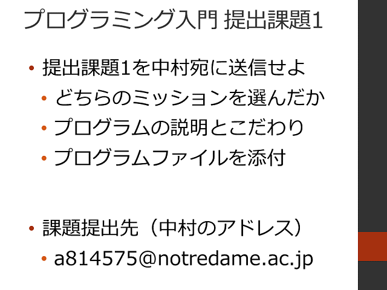

#  2016年度 情報処理G 第04回目

[←2016年度 情報処理Gのページに戻る](#!lecture/2016infoG.md)

## プログラミング入門

### 配布資料

- [プログラミング入門](programming.pdf)

### プログラミング入門

1. フィードバック＆前回の復習
2. [プログラミング入門 アンケートその2](https://goo.gl/forms/TSAoTgWnB6h24aa93)
3. LEDを制御してみよう
	- 演習課題1
4. フルカラーLEDを制御してみよう
	- 練習2-1
	- 練習2-2
	- 演習課題2
5. 提出課題1

## 本日の宿題

[←2016年度 情報処理Gのページに戻る](#!lecture/2016infoG.md)