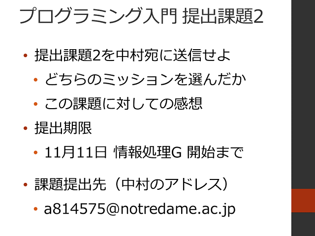
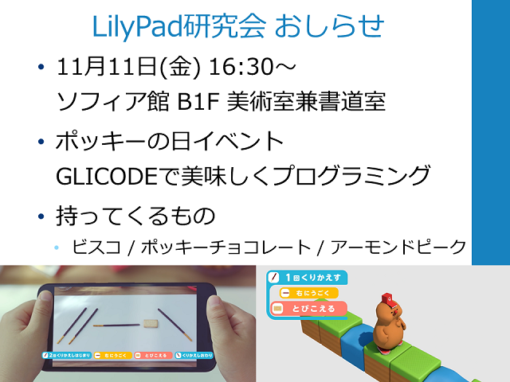

#  2016年度 情報処理G 第05回目

[←2016年度 情報処理Gのページに戻る](#!lecture/2016infoG.md)

## プログラミング入門

### 配布資料

- [プログラミング入門](programming.pdf)

### プログラミング入門

1. フィードバック＆前回の復習
2. [プログラミング入門 アンケートその3](https://goo.gl/forms/inPDUROzKIBGoFy53)
3. 何回も何回も同じ作業をさせよう！
	- 練習3-1
	- 練習3-2
	- 練習3-3
4. プログラムは何秒で終わるだろう？
	- [練習3-4](sampleCode.md#練習3-4)
	- [練習3-5](sampleCode.md#練習3-5)
5. 提出課題2

## 本日の宿題

## おしらせ

[←2016年度 情報処理Gのページに戻る](#!lecture/2016infoG.md)