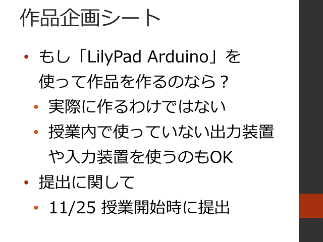
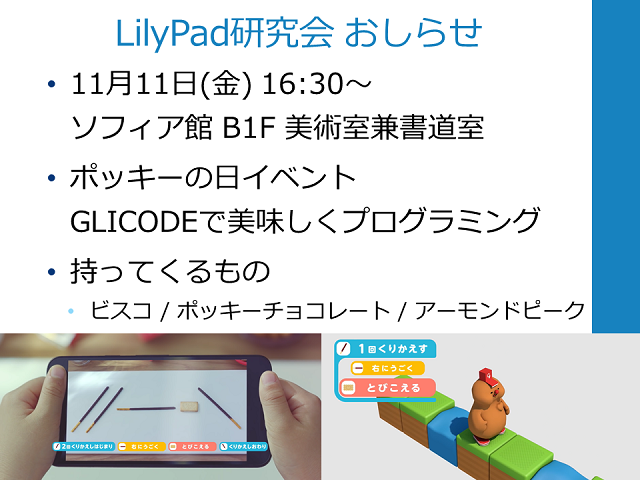

#  2016年度 情報処理G 第06回目

[←2016年度 情報処理Gのページに戻る](#!lecture/2016infoG.md)

## プログラミング入門

### 配布資料

- [プログラミング入門](programming.pdf)
- [作品企画シート](06/planningSheet.pdf)

### プログラミング入門4

1. フィードバック＆前回の復習
2. [みんなの提出課題1](prog1.md)
3. [プログラミング入門 アンケートその4](https://goo.gl/forms/msFCUHwyylN5JsAm2)
4. 周りの環境によって実行する処理を変えよう
	- 練習4-1
	- 練習4-2
	- 練習4-3
	- 練習4-4
5. 作品企画シートの記入

## 本日の宿題

## おしらせ

[←2016年度 情報処理Gのページに戻る](#!lecture/2016infoG.md)