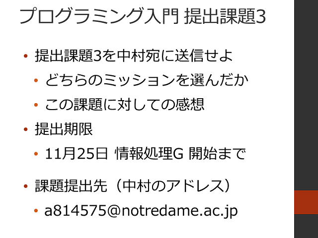

#  2016年度 情報処理G 第07回目

[←2016年度 情報処理Gのページに戻る](../2016infoG.md)

## プログラミング入門

### 配布資料

- [プログラミング入門](programming.pdf)
- [プログラミング入門過去問題](pro-kako.pdf)
- [作品企画シート](06/planningSheet.pdf)

### プログラミング入門5

1. フィードバック＆前回の復習
2. [プログラミング入門 アンケートその5](https://goo.gl/forms/eutEny4Q7DH7zU0e2)
3. 周りの環境によって実行する処理を変えよう
	- 練習4-5
4. 提出課題3

## 本日の宿題

[←2016年度 情報処理Gのページに戻る](../2016infoG.md)