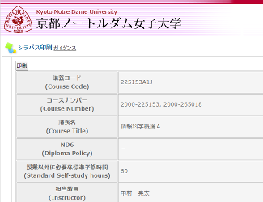

# 2017年度 情報科学概論A

## シラバス

画像をクリックすると全文を画像で閲覧できます。

### 科目の教育目標

一昔前までコンピュータは高価なものだったが、今では安価でパソコンを購入できるようになり、スマートフォンとよばれる高性能なコンピュータを肌身離さず持ち歩くようになっている。便利な電子機器が当たり前かのように身の回りに溢れるようにあるがゆえに、それらがどのように動いているかなど気にすることが少なくなってきている。
本科目では、コンピュータがどのように動いているのか、コンピュータのあらゆるデータが内部ではどのように表現されているのかを学び、コンピュータとどのように向き合っていくかを考えられるようになることを目標とする。

## 参考図書

参考図書として挙げたものは図書館の指定図書コーナーにて配架しております。

[参考図書の一覧](2017iisA/references.md)

## 授業

| 回数 | 授業日 | タイトル |
|:-:|:--|:--|
|第01回目|2017/04/14(金)|[授業の概要紹介，情報とデータ](2017iisA/01.md)|
|第02回目|2017/04/21(金)|[情報のデータ表現 - 数値の表現](2017iisA/02.md)|
|第03回目|2017/04/28(金)|[情報のデータ表現 - コンピュータ内部の計算](2017iisA/03.md)|
|第04回目|2017/05/12(金)|~~コンピュータの回路 - 論理回路の基本~~ コンピュータのデータ表現|
|第05回目|2017/05/19(金)|~~コンピュータの回路 - 加算器の仕組み~~ 情報の効率的なデータ表現 - データ圧縮と情報量|
|第06回目|2017/05/26(金)|情報のデータ表現のおさらい|
|第07回目|2017/06/02(金)|~~コンピュータのデータ表現~~ 情報の誤りを見つける，訂正する - 誤り検出|
|第08回目|2017/06/09(金)|~~情報の効率的なデータ表現 - データ圧縮と情報量~~ 情報の誤りを見つける，訂正する - 誤り訂正|
|第09回目|2017/06/16(金)|~~情報の誤りを見つける，訂正する - 誤り検出~~ コンピュータの回路 - 論理回路の基本|
|第10回目|2017/06/23(金)|~~情報の誤りを見つける，訂正する - 誤り訂正~~ コンピュータの回路 - 加算器の仕組み|
|第11回目|2017/06/30(金)|コンピュータでの問題解決 - データの検索アルゴリズム|
|第12回目|2017/07/07(金)|コンピュータでの問題解決 - データの整列アルゴリズム|
|第13回目|2017/07/14(金)|コンピュータでの問題解決 - さまざまなアルゴリズム|
|第14回目|2017/07/21(金)|コンピュータでの問題解決 - アルゴリズムとプログラム|
|第15回目|2017/07/28(金)|全体のまとめ，授業のポイントの整理|
|定期考査|2017/xx/xx(xx)|定期考査|
