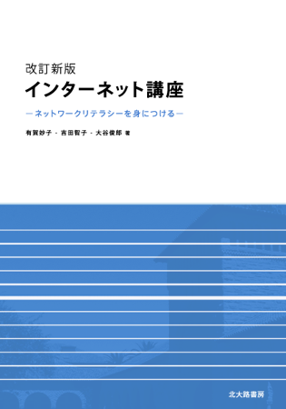

# 2017年度 情報処理F

## シラバス

### 科目の教育目標

インターネット上で使えるさまざまなサービス（機能）は、新しいコミュニケーション手段であり、情報伝達のためのメディアである。その中心は電子メールとWebページと言える。それらの操作を覚えるのはむずかしくないが、それを活用できる能力（ネットワークリテラシー）を身につけるには、教育が必要である。
この科目では、各機能の特性、多様性や可能性を理解するために、講義に加えて実習も行う。Webページの制作では、HTMLタグを直接記述する方法でのページを記述し、情報発信力を習得する。
さらに、コンピュータの本質を理解するために、PEN(Programming Environment for Novices)と呼ばれる初学者向けプログラミング環境を用いた、実習も行う。

## テキスト

[改訂新版 インターネット講座 -ネットワークリテラシーを身につける-](http://www.tomo.gr.jp/internet/)

## 授業

| 回数 | 授業日 | タイトル |
|:-:|:--|:--|
|第01回目|2017/09/29(金)|ガイダンス＆コンピュータの基礎知識|
|第02回目|2017/10/06(金)|インターネット上の機能（電子メールなど）の理解と利用|
|第03回目|2017/10/13(金)|プログラミング入門1|
|第04回目|2017/10/20(金)|プログラミング入門2|
|第05回目|2017/11/03(金)|プログラミング入門3|
|第06回目|2017/11/10(金)|プログラミング入門4|
|第07回目|2017/11/17(金)|プログラミング入門5|
|第08回目|2017/11/24(金)|OSとディレクトリ階層構造の理解|
|第09回目|2017/12/01(金)|情報検索と批判的閲覧|
|第10回目|2017/12/08(金)|HTMLで記述するWWWの情報提供のしくみと可能性|
|第11回目|2017/12/15(金)|MDwikiを使ったwebページ制作実習1|
|第12回目|2017/12/22(金)|MDwikiを使ったwebページ制作実習2|
|第13回目|2018/01/12(金)|MDwikiを使ったwebページ制作実習3|
|第14回目|2018/01/19(金)|webページの学内公開|
|第15回目|2018/01/26(金)|情報化社会を支える技術のテストと総まとめ|
